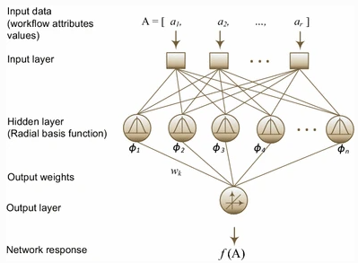
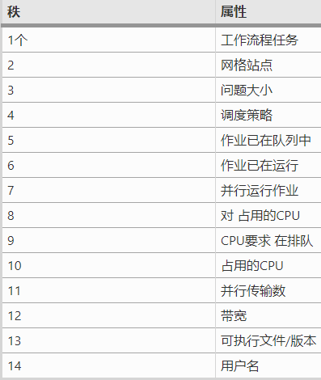

# 工作流大作业个人论文心得 17343105 田皓

## 论文题目

Nadeem2017_Article_ModelingAndPredictingExecution

## 论文作者及单位

Farrukh Nadeem，Daniyal Alghazzawi，Abdulfattah Mashat，Khalid Fakeeh，Abdullah Almalaise，Hani Hagras

## 发表期刊信息

Received: 1 November 2016 / Revised: 14 April 2017 / Accepted: 24 June 2017 / Published online: 12 July 2017

## 技术问题

随着电子科学的成熟，科学应用越来越复杂，由一组具有复杂依赖关系的协调任务组成，称为工作流。为了在Grid中优化工作流的执行，高级中间件服务（例如任务计划程序，资源代理，性能指导服务等）需要提前估算工作流程执行时间。但是，由于工作流中的多个任务，它们在多个异构Grid站点上的分布式执行以及共享Grid资源的动态行为，在Grid中建模和预测工作流执行时间很复杂。在本文中，作者描述了一种基于径向基函数神经网络的方法来建模和预测Grid中的工作流执行时间，解决了这个问题。

## 现实背景

计算网格使应用程序开发人员能够聚集分布在全球各地的异构计算和存储资源，以进行大规模的科学和工程研究。近年来，科学工作流应用程序已成为表示和管理复杂科学计算的重要范例。工作流应用程序通常通过工作流管理系统，例如Askalon，GridFlow，Pegasus，等在Grid上执行。这种工作流管理系统的运行时环境计划并管理多个Grid站点上工作流任务的执行，目的是使工作流执行时间最小化。工作流执行时间被广泛认为是衡量工作流性能的指标。

给出了针对三个现实世界科学工作流的预测实验结果：MeteoAG，Invmod和Wien2K。

## 作者思路

根据描述工作流程结构和执行运行时信息的属性对工作流程执行时间进行建模，使用主成分分析来消除重要性较低的属性。

## 解决方案

### 使用径向基函数神经网络建模工作流执行时间

径向基函数神经网络是使用径向基函数作为网络激活函数的人工神经网络。由于它的快速训练和全局逼近功能，它是用于插补多元分散数据的流行工具。使用RBF-NN进行工作流执行时间建模，找到映射工作流属性集的插值函数$ f(A) $ ,神经网络结构如下图：

第一层是输入层，接受工作流属性值集合$ A_i = \{a^i_1, a^i_2,..\}$，第二层是隐藏层，每个神经元计算$A_i$和中心$（d_i = ||A_i-c||）$的欧氏距离，并将高斯函数用作径向函数，中心是通过k聚类算法确定的。第二层的输出$\phi(d_i)$通过权重$w_i$传递到第三层，将*f*（*A*）近似为*n个*神经元的线性组合，使得
$$
f(A) = \sum_{i=1}^n{w_i\phi_i(d_i)}
$$
使用RBF-NN的主要动机是即使在工作流属性在m维空间中具有复杂分布的情况下，它也具有处理多个工作流属性和开发执行时间模型的能力。RBF-NN的一个缺点是它无法区分工作流属性的相对重要性，因此尝试优化所有属性的权重。这会影响模型的准确性。为了补偿这种影响，采用了主成分分析以消除重要性较低的属性，而仅在模型中考虑较重要的属性。这样可以提高模型的准确性。

### 通过主成分分析降低尺寸

主成分分析（PCA）是一种流行的数学程序，可以在不损失大量信息的情况下将大尺寸空间的尺寸降低为小尺寸空间。PCA从给定的相关值数据集中提取重要信息，并使用正交变换将其转换为不相关值的数据集，称为主成分。可以根据需要减少主要成分。

### RBF-NN培训和评估

作者根据工作流属性在数据中的差异对它们进行排序。下表中显示了前14个属性及其等级，能够将维度从21减少到14。

表中的等级1表示最高等级。属性的等级越高，归因于该属性的数据差异就越大。这意味着属性的等级越高，对工作流执行时间进行建模就越重要。因此，表中按属性对工作流属性建模的重要性顺序显示了属性。作者在奥地利网格进行试验，

## 创新贡献

三个主要贡献如下：

1. 与相关领域中其他的方法相比，本方法的预测精度最高。

2. 基于工作流属性对工作流执行时间建模的重要性进行排序。

3. 通过减少重要性较低的属性来减少为有效地建模工作流执行时间所需的一组工作流属性，采用推荐的属性集不仅节省大量时间，精力和系统资源来收集跟踪数据，而且还会提高预测准确性。此外，这还将有助于将来为工作流执行时间建模的工作。

## 效果评价

网格工作流应用程序由多个任务组成，这些任务之间具有数据并控制流依赖性。高级网格服务需要工作流执行时间预测，以最佳地利用可用资源。但由于复杂的工作流结构，工作流在多个Grid站点上的分布式执行以及Grid的动态性质，预测工作流执行时间具有挑战性。在本文中，作者根据描述其静态和运行时信息的属性对每个工作流程执行进行参数化，并使用基于RBF-NN的新颖方法对工作流程的总体执行时间进行建模和预测。为了进一步优化RBF-NN模型的准确性，作者评估了工作流程属性对工作流程执行时间建模的相对重要性。使用主成分分析，将属性减少14个，这些属性会极大地影响工作流程的总体执行时间。通过减少工作流属性集可以通过以下方式提高预测准确性：16%（与使用全部21个属性的预测准确性相比）。工作流程属性的减少也将有助于提高工作流程绩效建模未来工作的准确性。与相关工作中的类似方法相比，该方法产生的预测误差最低。预测中的标准化误差比相关工作中使用其他两种方法（使用模板和本地学习框架）的预测误差分别低46％和30％，这两种方法迄今为止均能提供最高的预测精度。

## 个人观点

作者使用了RBF-NN来计算网格工作流的执行时间，通过主成分分析来降低了复杂度，提高了准确性。对于任务的工作量估计一直都是一个难题，并且本文研究的还是网格工作流这样一个系统性的时间估计。与同领域的其他方法相比，作者给出的方法准确度更高。将主成分分析运用到神经网络预测网格工作流的时间中是作者比较巧妙的想法，我们在做科研或者工程时也可以学习。

